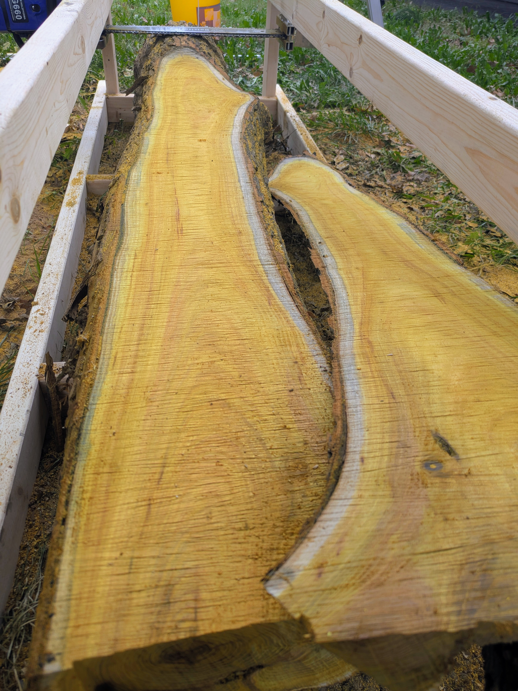

---
title: "New milling rig and Osage Orange first cut"
date: 2025-10-19
description: "Ripping off someone else's idea, plus pretty wood"
series: "Adventures in Chainsaw Milling"
tags: ["woodworking"]
--- 

I happened across some older Izzy Swan videos[^1] that inspired me to make some changes to how I was milling. I realized that it's not too hard to set up a platform and a parallel rail that the aluminum "Alaskan mill" can ride along. I really liked the intersection of cost, effort, and usefulness of the materials after this project[^2]. I started with a quick sketchup.

I assembled the frame just with screws on my garage floor. I'm not interested in perfect for this build, so using the concrete as a guide was plenty accurate.

The only real hitch came when I realized that the way I had set up the supports for the upper rails took away 4-6 inches of length capacity. Again, I decided to take on the mindset of "good enough is good enough" with this one. I'm reminded of [the Cult of Done](https://medium.com/@bre/the-cult-of-done-manifesto-724ca1c2ff13), which is something that I've been partially inspired by a couple of times, but never engaged with enough to fully embrace. Anyway, I figured 6-ish feet of length capacity was good enough for a casual milling setup anyway, and if I really needed to adjust the construction, I could add back in some of that by moving where the upper rail supports are attached.

I have been especially struggling with the first cut of a log, where I needed to attach something to top to give the Alaskan mill something flat to reference. I had been using a long board, but it wasn't rigid enough and ended up bending at the extremes. This setup solves that problem nicely, since no part of the rails are actually indexing off the log itself and the Alaskan mill rides along the upper rails with solid contact. I didn't set the mill quite "deep" enough on the first cut (so the lowest section of the log, at the very end, did not get cut), but I'm still extremely pleased with the setup.

Most exciting is how the Osage Orange looks after this first cut. It's even more vibrant than I expected and I'm really looking forward to using it!

Fun fact, I had to enhance the saturation on these images just to make them look like real life. The photos, as they originally came out of my phone, were *much* flatter, but after edits the color is quite true-to-life.

I know that these slabs will lose some of their color as they dry, but I'd be surprised if they still didn't end up being some of the prettiest wood I've ever used.

(But tbh I haven't used a lot of wood)

[^1]: https://youtu.be/wydrpqTvwqs, https://youtu.be/09ixWGEvlAI, https://youtu.be/bzjZ0qla_to, https://youtu.be/ykeQMSUc0wk
[^2]: Particularly when it comes to the first cut, common alternatives include a straight metal ladder (which I don't have, or have another use for) and unistrut ($$$!). After this project, I can disassemble the frame and be left with generally useful materials.